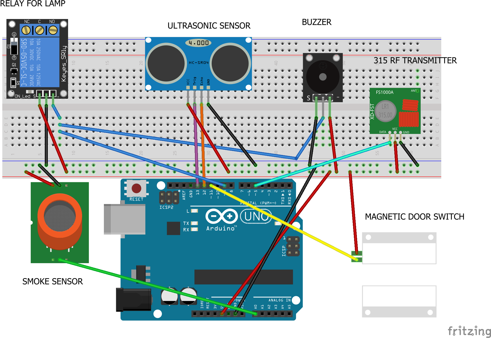
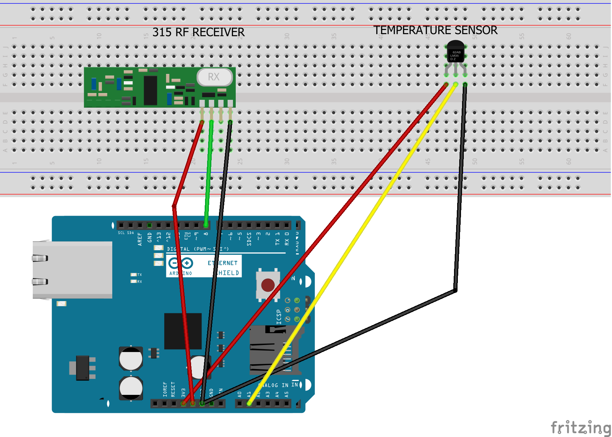
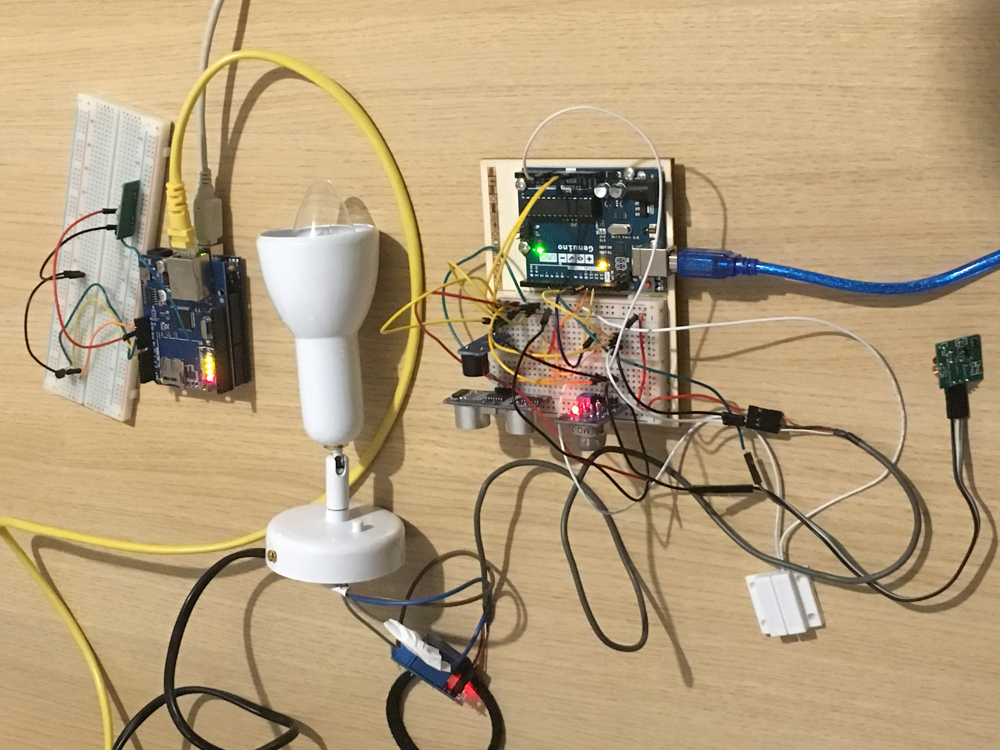

Σύστημα Ασφαλείας με Arduino συνδεδεμένο στο διαδίκτυο 
======================================================

 
 Εισαγωγή
=========

Το project που κατασκευάσαμε στα πλαίσια του μαθήματος «Τεχνικές
Διασύνδεσης Ψηφιακών Συστημάτων» αποτελεί ένα σύστημα για την ανίχνευση
εισβολέων σε ένα χώρο, καθώς και την ανίχνευση του φυσικού κινδύνου της
φωτιάς. Το σύστημα αυτό μπορεί να επιβλέπεται από έναν απομακρυσμένο
χρήστη διαδικτυακά.\
Αναλυτικότερα, χρησιμοποιήσαμε δύο συσκευές οι οποίες επικοινωνούν
μεταξύ τους. Η πρώτη ανιχνεύει την παραβίαση μιας πόρτας ή παραθύρου,
την κίνηση και την ύπαρξη καπνού, ενώ η δεύτερη μετράει τη θερμοκρασία
και στέλνει όλες τις μετρήσεις των αισθητήρων σε μία σελίδα που
δημιουργήσαμε στο διαδίκτυο.

Για την υλοποίηση του project χρειάστηκαν τα εξαρτήματα:

-   2 Arduino Uno

-   1 Ethernet Shield

-   1 αισθητήρα θερμοκρασίας (TMP36)

-   magnetic door switch

-   RF (radio frequency) 315 MHz ζεύγος πομπού-δέκτη
    (transmitter-receiver module)

-   1 αισθητήρα απόστασης – κίνησης (ultrasonic sensor)

-   1 ρελέ (relay) (optional)

-   1 λάμπα (optional)

-   1 αισθητήρα καπνού (MQ2 gas sensor)

-   1 buzzer (optional)

-   2 Breadboards

-   καλώδια

-   αντιστάσεις

Τα παραπάνω υλικά τα προμηθευτήκαμε από το κατάστημα Hellas Digital στην
Αθήνα και το συνολικό τους κόστος ήταν 54 ευρώ.

Συσκευή 1η – Ανιχνευτής εισβολέα, καπνού
==========================================

Αυτή η συσκευή περιλαμβάνει το ένα Arduino, αισθητήρα απόστασης –
κίνησης, αισθητήρα καπνού (MQ2 gas sensor), magnetic door switch, το
ρελέ με τη λάμπα, buzzer κι έναν πομπό RF (radio frequency).

Ο **αισθητήρας απόστασης – κίνησης** λειτουργεί εκπέμποντας υπερήχους οι
οποίοι ανακλώνται πάνω στα αντικείμενα που βρίσκονται μπροστά του και
επιστρέφουν στον αισθητήρα, ο οποίος από τη χρονική διαφορά τις εκπομπής
και της λήψης υπολογίζει την απόσταση. Αυτόν τον αισθητήρα τον
χρησιμοποιούμε για την ανίχνευση κίνησης μέσω της μεταβολής απόστασης.
Δέχεται γείωση GND, echo, trigger και Vcc. Τοποθετούμε το GND στο GND
του Arduino, το VCC συνδέεται με τάση ίση με 5V, το Echo με το 12^o^
Digital pin, ενώ το Trigger καταλήγει στο 13^o^ Digital pin. Επίσης, για
τον συγκεκριμένο αισθητήρα χρησιμοποιήθηκε μία επιπλέον βιβλιοθήκη
(library). Αυτή ονομάζεται NewPing και μπορεί να βρεθεί στην σελίδα της
Arduino στο παρακάτω link:
urlhttps://bitbucket.org/teckel12/arduino-new-ping/downloads
.

Ο **αισθητήρας καπνού** λειτουργεί με το φαινόμενο απορρόφησης
ακτινοβολίας. Ο καπνός μεταβάλλει τη σύσταση του υλικού που βρίσκεται
μέσα στον αισθητήρα αλλάζοντας την αντίστασή του κι έτσι η τάση εξόδου
Vout μεταβάλλεται, με υψηλότερη τάση εξόδου να σημαίνει περισσότερος
καπνός. Το ποτενσιόμετρο που βρίσκεται πίσω από τον αισθητήρα ελέγχει
την ευαισθησία του. Δέχεται ακόμη (Analog pin) A0, (Digital pin) D0,
τροφοδοσία Vcc και γείωση GND. Στην παρούσα εργασία χρησιμοποιούμε το A0
του αισθητήρα και το ενώνουμε στο αντίστοιχο A0 (Analog pin 0) του
Arduino και με την VCC και GND στα 5V και στο GND του Arduino
αντίστοιχα.

Ο **αισθητήρας magnetic door switch** που ανιχνεύει το άνοιγμα της
πόρτας. Όταν τα δύο εξαρτήματα έρχονται σε επαφή έλκονται οι μαγνητικές
επαφές και το κύκλωμα κλείνει. Σε διαφορετική περίπτωση το κύκλωμα είναι
ανοιχτό. Έχει δύο συνδέσεις. Η μία ενώνεται στην τάση που είναι ίση με 5
Volt και η άλλη πηγαίνει στο D11 του Digital In.

Το **ρελέ** εμφανίζει συμπεριφορά διακόπτη σε κυκλώματα υψηλής τάσης (πχ
220V). O διακόπτης μπορεί να ελεγχθεί από ένα control pin, παίρνει
τροφοδοσία 5V (Vcc) και γείωση (GND). Το ρελέ έχει 3 ports τα VCC, GND
και VIN. Τα δύο πρώτα συνδέονται στην τάση 5 V και GND αντίστοιχα, ενώ
το VIN συνδέεται στο Digital pin 9 του Arduino.

O **buzzer** έχει ένα control pin που όταν δεχθεί μηδενική τάση παράγει
ήχο, τροφοδοσία (Vcc τοποθετούμε 5V) και γείωση (GND). Ενώ το άλλο pin
(I-O) του buzzer το συνδέουμε στο Digital pin 9 του Arduino.

Το **RF module** χρησιμοποιείται για την επικοινωνία με τον RF receiver
ο οποίος βρίσκεται στη δεύτερη συσκευή. Δέχεται 3 pins, Data, Vcc, GND.
To Data συνδέεται στο Digital 5 του Arduino, το Vcc στο 5V και το GND
στη γείωση. Αφιερώνεται ξεχωριστή ενότητα στην επικοινωνία μέσω του RF
Module παρακάτω.

Κύκλωμα 1ης συσκευής

GND –\> GND, ECHO –\> PIN D12, TRIGGER –\> PIN D13, VCC –\> 5V\

Vcc –\> 5V, Α0 –\> Α0, GND –\> GND, D0 –\> NO USE\

Vcc –\> 5V, GND –\> GND, Vin –\> D9\

Vcc –\> 5V, GND –\> GND, Ι-Ο pin –\> D9\

Vcc –\> 5V, GND –\> GND, Data –\> D5\

Κώδικας 1ης Συσκευής <codes/dev1.ino>

Ο κώδικας παρουσιάζεται με σχόλια, ωστόσο θα θέλαμε να τονίσουμε
ιδιαίτερα ορισμένα σημεία που μας δυσκόλεψαν. Παρατηρήσαμε ότι ο
αισθητήρας απόστασης – κίνησης αφενός εμφανίζει ως έξοδο σε τακτά
χρονικά διαστήματα μηδενικά τα οποία δεν ανταποκρίνονται στην απόσταση
που «βλέπει» και αφετέρου οι μετρήσεις απόστασης είναι ασταθείς. Για την
επίλυση των δύο παραπάνω προβλημάτων αφενός παίρνουμε μόνο τις τιμές
μεγαλύτερες του μηδενός και αφετέρου υπολογίζουμε τον μέσο όρο έξι μη
μηδενικών μετρήσεων. Τα παραπάνω υλοποιούνται στη συνάρτηση *read()*
(βλ. γραμμές *31-40*). Επιπλέον, για τη μεταφορά δεδομένων μέσω RF με
την εντολή *vw\_send* απαιτείται να δώσουμε ως είσοδο έναν πίνακα από
bytes. Η εργασία μας απαιτεί τη μεταφορά ενός ακέραιου αριθμού (ο οποίος
δηλώνει τη τρέχουσα κατάσταση των αισθητήρων) ο οποίος μετατρέπεται σε
πίνακα χαρακτήρων (char array) μέσω της συνάρτησης *itoa()*, γιατί *char
= byte*. Αυτό υλοποιείται στις γραμμές *99-102*.

Συσκευή 2η – Μέτρηση θερμοκρασίας, επικοινωνία με το διαδίκτυο 
=================================================================

Αυτή η συσκευή περιλαμβάνει ένα Arduino, αισθητήρα θερμοκρασίας, τον
δέκτη RF και το Ethernet Shield.

O **αισθητήρας θερμοκρασίας** μετράει τη θερμοκρασία του περιβάλλοντος
μέσω της τάσης εξόδου η οποία είναι ανάλογη με τη μεταβολή της
θερμοκρασίας σε βαθμούς Celsius. Δέχεται 3 pins, τροφοδοσία Vcc (την
τροφοδοτούμε με τάση 3.3V από το pin Vcc του Ethernet Shield), τάση
εξόδου (Vout), γείωση GND. Ο ακροδέκτης της τάσης εξόδου Vout του
αισθητήρα συνδέεται με το A1 του Analog In του Arduino.

To **Ethernet Shield** χρησιμοποιείται για να επικοινωνήσει το Arduino
με το Διαδίκτυο.

O **RF δέκτης** χρησιμοποιείται για την επικοινωνία με τον RF πομπό ο
οποίος βρίσκεται στην πρώτη συσκευή. O αισθητήρας RF receiver έχει 4
pins, τα οποία είναι με την σειρά από αριστερά προς τα δεξιά VCC, DATA,
DATA και GND. Στην παρούσα εργασία χρησιμοποιούνται το VCC και το GND
καθώς και ένα εκ των δύο DATA. Το VCC συνδέεται σε θύρα τάσςη 5V. Το GND
στη γείωση. Τέλος, το DATA port συνδέεται στο όγδοο Digital pin (D8).
Αφιερώνεται ξεχωριστή ενότητα στην επικοινωνία μέσω του RF Module
παρακάτω.

Κύκλωμα 2ης συσκευής

Vcc –\> 3.3V, GND –\> GND, Vout –\> A1\

Vcc –\> 5V, GND –\> GND, Data –\> D8\

Κώδικας 1ης Συσκευής <codes/dev2.ino>

Και στη δεύτερη συσκευή θα θέλαμε να τονίσουμε ορισμένα λεπτά σημεία.
Καταρχάς, επισημαίνεται ότι για τη σωστή λειτουργία του Ethernet Shield
πρέπει να μην χρησιμοποιούνται τα digital pins *10-13* για τη διασύνδεση
εξαρτημάτων, καθώς αυτά απαιτούνται για την επικοινωνία μεταξύ του
Ethernet Shield και του Arduino. Επίσης, για να ερμηνεύσουμε τα δεδομένα
που λαμβάνουμε μέσω της επικοινωνίας RF κάθε byte που λαμβάνεται
αποθηκεύεται σε ένα πίνακα από χαρακτήρες, όπου στο τέλος αυτού του
πίνακα τοποθετείται ο ειδικός χαρακτήρας τερματισμού string. Έπειτα
χρησιμοποιούμε την συνάρτηση *atoi()* (αντίστροφη της συνάρτησης
*itoa()* ) για να μετατρέψουμε τον πίνακα χαρακτήρων σε ακέραιο.
(γραμμές *86-90* )

RF Module – Επικοινωνία των δύο Arduino
=======================================

Το RF module αποτελείται από ένα πομπό (transmitter) που βρίσκεται στην
πρώτη συσκευή κι έναν αποδέκτη (receiver) που βρίσκεται στη δεύτερη
συσκευή.\
Μέσω αυτής της RF επικοινωνίας μεταφέρονται ασύρματα οι μετρήσεις των
αισθητήρων της 1ης συσκευής (δηλαδή αισθητήρας καπνού, απόστασης –
κίνησης και magnetic door switch) και τα οποία στέλνονται online μέσω
του Ethernet Shield. Επίσης, στέλνεται online και η μέτρηση της
θερμοκρασίας από την 2η συσκευή.\
Αξίζει σε αυτό το σημείο να σημειωθεί ότι παρότι τα τεχνικά
χαρακτηριστικά (specifications) του RF module δηλώνουν για τον
transmitter: Launch distance: 20-200 meters (different voltage,
different results) και Operating voltage: 3.5-12V, ωστόσο δεν
ανταποκρίνονται στην πραγματικότητα, καθώς έπειτα από δοκιμές με
διάφορες τιμές τάσης η μέγιστη απόσταση λειτουργίας παρέμενε περίπου 2m.
Έπειτα από σχετική έρευνα συμπεράναμε ότι αρκετές φορές η επιλογή πάρα
πολύ φθηνών εξαρτημάτων εγκιμονεί τον κίνδυνο να μην ανταποκρίνονται στα
διαφημιζόμενα χαρακτηριστικά τους.\
Για να μεταφέρουμε την πληροφορία μέσω του RF module χρησιμοποιείται μια
μορφή κωδικοποίησης. Ειδικότερα, η κωδικοποίηση που χρησιμοποιούμε
περιλαμβάνει:

[1]\>m\#1

[16pt] | M0.55 | M0.38 | N
Ενεργοποιημένοι Αισθητήρες & Σήμα που μεταδίδει ο Receiver &\
[9pt] Smoke Sensor & 1 &\
[9pt] Ultrasonic Sensor & 2 &\
[9pt] Smoke και Ultrasonic Sensors & 3 &\
[9pt] Magnetic Door Switch Sensor & 4 &\
[9pt] Smoke και Magnetic Door Switch Sensors & 5 &\
[9pt] Ultrasonic και Magnetic Door Switch Sensors & 6 &\
[9pt] Όλα μαζί & 7 &\
[9pt]

Για την σωστή λειτουργία του RF module απαιτείται η χρήση της
βιβλιοθήκης (Library) VirtualWire. Μπορεί να βρεθεί στο παρακάτω link:
<https://www.pjrc.com/teensy/td_libs_VirtualWire.html>

Διαδικτυακή πρόσβαση
====================

Δημιουργήσαμε μία ιστοσελίδα με την οποία επικοινωνεί το Ethernet Shield
και στην οποία ανεβάζει τα δεδομένα από τους αισθητήρες (θερμοκρασίας,
magnetic door switch, καπνού και απόστασης – κίνησης). Τα δεδομένα αυτά
μπορεί να τα δει ο χρήστης οπουδήποτε κι αν βρίσκεται, μέσα από το URL:
<http://www.edged.xyz/connect/> (γενικά:
<http://www.yourdomain.smth/connect/>).

Για τη δημιουργία μιας αντίστοιχης σελίδας μπορείτε να χρησιμοποιήσετε
ένα από τα πολλά free hosting services που υπάρχουν στο web, όπως
000webhost.com, hostinger.gr κ.α. Στη συνέχεια, θα πρέπει να ανεβάσει
κανείς τα αρχεία index.php και submitdata.php μέσω ftp client ή μέσω του
web interface του hosting service. Σημειώνεται ότι το αρχείο
submitdata.php θα δημιουργήσει ένα τρίτο αρχείο data.php, στο οποίο
αποθηκεύονται οι τιμές των μετρήσεων. Tο URL της ιστοσελίδας που θα
χρησιμοποιηθεί θα πρέπει να μπει στον κώδικα της δεύτερης συσκευής στο
όνομα του server και στο όνομα του Host (τα δύο σημεία υποδεικνύονται
από τα σχόλια).

Παρακάτω παρουσιάζονται οι κώδικες των δύο αυτών αρχείων:

**submitdata.php** <php/submitdata.php>

**index.php** <php/index.php>

Παρουσίαση Τελικού αποτελέσματος
================================

Παρακάτω παρουσιάζεται τα τελικά αποτελέσματα της εργασίας μας.

Εδώ φαίνεται η καταγραφή των μετρήσεων στην ιστοσελίδας μας. Πιο
συγκεκριμένα, στην πρώτη γραμμή φαίνεται η τελευταία ενημέρωση. Στη
συνέχεια παρουσιάζεται η τρέχουσα κατάσταση και πότε είχαμε την
τελευταία ειδοποίηση.

Εδώ φαίνεται ο σχεδιασμός του συστήματος ασφαλείας σε φωτογραφία.

Παρακάτω παρουσιάζεται και το link του github για το project:
<https://github.com/dbarmperis/Digital-Systems-Interfaces.git>

Αναφορές
========

9 Markus Ulfberg *Arduino: Sending integers over RF with
VirtualWire*.
<http://genericnerd.blogspot.gr/2012/07/arduino-sending-integers-over-rf-with.html>.

Aritro Mukherjee. *Smoke Detection using MQ-2 Gas Sensor*.
<https://create.arduino.cc/projecthub/Aritro/smoke-detection-using-mq-2-gas-sensor-79c54a>.

lady ada. *TMP36 Temperature Sensor*.
<https://learn.adafruit.com/tmp36-temperature-sensor/using-a-temp-sensor>.

arduino.cc. *Web Client Repeating*.
<https://www.arduino.cc/en/Tutorial/WebClientRepeating>.
